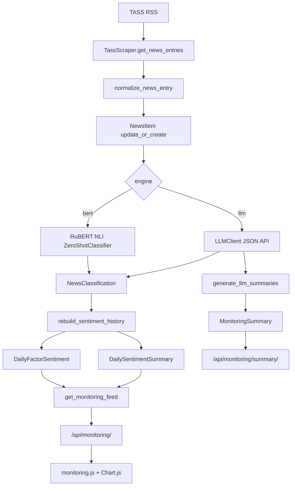

# Deep Research: news-zero-shot / Social Risk Monitor

Снимок проекта: 2026-05-04. Анализ сделан по текущему рабочему дереву `C:\Users\whynot\VSCodeProjects\news-zero-shot`, включая незакоммиченные изменения, локальную SQLite-базу, Docker/CI-конфиги, тесты и служебные скрипты.

## 1. Короткий вывод

Проект превратился из простой zero-shot лаборатории для классификации свежих новостей в полноценный Django-мониторинг социальных рисков по новостной ленте. Сейчас есть две основные поверхности:

- `Мониторинг`: ежедневная панель социальных факторов, динамика тональности, индекс давления, всплески, последние сигнальные новости, BERT/LLM-переключатель.
- `Лаборатория`: ручной zero-shot анализ текущих новостей ТАСС по пользовательским парам формулировок.

Главная новая архитектурная идея: вместо произвольных пользовательских классов для истории используется фиксированный каталог социальных факторов. Это делает метрики сравнимыми по дням, движкам, моделям и версиям промптов.

Сейчас поддерживаются два движка анализа:

- `bert`: локальная NLI-модель `cointegrated/rubert-base-cased-nli-threeway`.
- `llm`: локальный/OpenAI-compatible/Ollama-style JSON API, по текущему `.env` включен `gemma4:e2b` через `http://localhost:11434`.

Тестовая сборка рабочая: `29 passed`, покрытие `83.31%`, Django system check без ошибок, миграции analyzer применены до `0004`.

## 2. Состояние репозитория

Текущая ветка: `test`.

HEAD: `388fa68 (HEAD -> test, origin/main) Merge pull request #6 from whyynoot/test`.

Рабочее дерево не чистое. Изменены tracked-файлы:

- `.env.example`
- `Dockerfile`
- `README.md`
- `analyzer/models.py`
- `analyzer/tasks.py`
- `analyzer/templates/analysis.html`
- `analyzer/templates/base.html`
- `analyzer/tests.py`
- `analyzer/views.py`
- `analyzer/zero.py`
- `docker-compose.yml`
- `news/scraper/tass.py`
- `news_analyzer/settings.py`
- `news_analyzer/urls.py`
- `pytest.ini`
- `requirements.txt`

Untracked-файлы/папки с важной новой функциональностью:

- `analyzer/constants.py`
- `analyzer/llm_client.py`
- `analyzer/llm_prompts.py`
- `analyzer/llm_services.py`
- `analyzer/monitoring_service.py`
- `analyzer/data/social_risk_seed.json`
- `analyzer/management/commands/*.py`
- `analyzer/migrations/0001..0004.py`
- `analyzer/static/analyzer/*`
- `analyzer/templates/monitoring.html`
- `scripts/llm_worker.ps1`

Также есть локальные артефакты: `db.sqlite3`, `.coverage`, `coverage.xml`, `htmlcov/`, `tmp-ui-checks/`, временные Edge-профили, Excel/zip-файлы.

## 3. Технологический стек

Backend:

- Python, Django `4.2.x`
- Django REST Framework
- SQLite как текущая БД
- WhiteNoise для static files
- Gunicorn для production Docker CMD

ML/NLP:

- PyTorch
- Transformers
- RuBERT NLI: `cointegrated/rubert-base-cased-nli-threeway`
- NumPy
- scikit-learn есть в зависимостях, но в текущей логике не является ключевым runtime-компонентом.

LLM:

- `requests`
- JSON-only client под Ollama `/api/chat`, Ollama `/api/generate` и OpenAI-compatible `/v1/chat/completions`.
- Текущие настройки из `.env`: `LLM_ENABLED=True`, `LLM_BASE_URL=http://localhost:11434`, `LLM_MODEL=gemma4:e2b`, `LLM_BATCH_NEWS_SIZE=1`, `LLM_CONCURRENCY=1`, API key не задан.

Frontend:

- Django templates
- Vanilla JS
- Chart.js CDN
- CSS без frontend build step
- Темная/светлая тема через `localStorage` и CSS variables

DevOps:

- Dockerfile
- docker-compose
- GitHub Actions CI
- pytest / pytest-django / pytest-cov

## 4. Размер и форма кодовой базы

Самые крупные файлы:

- `analyzer/monitoring_service.py`: 1054 строки, ядро мониторинга.
- `analyzer/static/analyzer/css/app.css`: 1016 строк, вся UI-система.
- `analyzer/tests.py`: 644 строки, основной тестовый набор.
- `analyzer/llm_services.py`: 652 строки, классификация и summary через LLM.
- `analyzer/static/analyzer/js/monitoring.js`: 572 строки, клиент мониторинга.
- `analyzer/models.py`: 320 строк, модели и APIViews.
- `analyzer/static/analyzer/js/analysis.js`: 304 строки, клиент лаборатории.

Структура проекта:

```text
news-zero-shot/
  analyzer/
    constants.py
    models.py
    monitoring_service.py
    llm_client.py
    llm_prompts.py
    llm_services.py
    tasks.py
    zero.py
    data/social_risk_seed.json
    management/commands/
    static/analyzer/
    templates/
    tests.py
  news/
    news.py
    base_news/baseNews.py
    scraper/tass.py
  news_analyzer/
    settings.py
    urls.py
    wsgi.py
    asgi.py
  scripts/llm_worker.ps1
  Dockerfile
  docker-compose.yml
  pytest.ini
  README.md
```

## 5. Доменная модель

Основные новые модели находятся в `analyzer/models.py`.

### `RiskFactor`

Справочник факторов:

- `key`
- `name`
- `description`
- `positive_label`
- `negative_label`
- `weight`
- `display_order`
- `is_active`

Сейчас активных факторов 8:

| key | Название | Вес |
| --- | --- | --- |
| `birth_rate` | Рождаемость | 1.15 |
| `housing_access` | Доступность жилья | 1.0 |
| `employment` | Занятость и безработица | 1.2 |
| `healthcare_access` | Доступность медицины | 1.1 |
| `household_income` | Доходы населения | 1.1 |
| `poverty` | Уровень бедности | 1.2 |
| `family_stability` | Семейная стабильность | 0.9 |
| `life_expectancy` | Продолжительность жизни | 1.0 |

### `NewsItem`

Хранит нормализованную новость:

- источник
- внешний id
- URL
- заголовок
- краткое описание
- текст
- категория
- дата публикации
- seed/live-признак

Уникальность: `(source, external_id)`.

### `NewsClassification`

Факторная классификация конкретной новости:

- `positive_probability`
- `negative_probability`
- `sentiment_score`
- `relevance`
- `pressure`
- `sentiment_label`
- `confidence`
- `evidence`
- `reason`
- `is_relevant`
- `engine`
- `model_name`
- `prompt_version`
- `factor_catalog_version`
- `content_hash`
- `raw_response`

Ключевая уникальность: одна классификация на `(news_item, factor, engine, model_name, prompt_version, factor_catalog_version)`.

Это позволяет хранить параллельно BERT и LLM результаты, а также не смешивать разные версии промпта/модели.

### `DailyFactorSentiment`

Дневной срез по одному фактору:

- средняя тональность по релевантным новостям
- изменение к предыдущему дню
- количество всех/релевантных новостей
- positive/negative/neutral hits
- top positive/top negative новость
- engine/model/prompt/catalog identity

### `DailySentimentSummary`

Дневной общий срез:

- `average_sentiment`
- `delta_from_previous`
- `risk_index`
- `news_count`
- `factor_count`

`risk_index` считается как взвешенная доля отрицательных факторных средних:

```text
sum(max(-factor_average_sentiment, 0) * factor_weight) / sum(factor_weight)
```

### `MonitoringBatch`

Журнал запусков pipeline:

- `mode`: seed/backfill/update
- `status`: success/skipped/failed/partial_failed
- engine/model/prompt/catalog
- source
- started/finished
- fetched/stored/classifications
- details JSON

### `MonitoringSummary`

LLM-generated краткие summary по фактору за период:

- factor
- period start/end
- engine/model/prompt/catalog
- input_hash
- trend
- risk_level
- confidence
- summary
- main_drivers
- raw_response

## 6. Архитектура потоков данных



## 7. Источник новостей

`news/scraper/tass.py` читает публичный RSS:

- URL: `https://tass.ru/rss/v2.xml`
- timeout: 10 секунд
- max items: `parse_pages * batch_size`, сейчас `10 * 20 = 200`
- dedupe по URL или тексту
- clean HTML через regex + `html.unescape`
- дата через `email.utils.parsedate_to_datetime`

Фильтрация релевантности:

- категории: `Общество`, `Экономика и бизнес`, `Наука`, `Недвижимость`, `Москва`
- ключевые слова: демография, семья, рождаемость, жилье, ипотека, безработица, занятость, медицина, здравоохранение, доход, бедность, соц, население, жизнь

Если релевантных новостей нет, scraper возвращает fallback-список новостей из RSS.

## 8. BERT-классификация

`analyzer/zero.py` реализует NLI zero-shot:

1. Для каждой новости строятся пары premise/hypothesis.
2. Hypothesis = positive/negative label фактора.
3. Модель возвращает logits по NLI-классам.
4. Берется вероятность `entailment`.
5. Вероятности по двум labels нормализуются в строке.

В мониторинге BERT-поток работает так:

1. `classify_live_news_items` берет pending news.
2. Для каждого фактора вызывает `predict_batch(texts, [positive_label, negative_label])`.
3. Считает:
   - `sentiment_score = positive_probability - negative_probability`
   - `relevance = abs(sentiment_score)`
   - `pressure = max(-sentiment_score, 0)`
   - `confidence = max(positive_probability, negative_probability)`
   - `sentiment_label`: positive/negative/neutral при пороге `0.20`
   - `is_relevant`: `abs(score) >= 0.20`
4. Сохраняет `NewsClassification`.
5. Перестраивает дневные агрегаты.

Кэширование:

- классификация пропускается, если для новости уже есть все факторные результаты с тем же `content_hash` и той же engine identity.
- `force=True` игнорирует кэш.

## 9. LLM-классификация

LLM-слой разделен на:

- `llm_client.py`: транспорт, настройки, JSON parsing/retry.
- `llm_prompts.py`: системные и пользовательские промпты.
- `llm_services.py`: подготовка входа, нормализация ответа, сохранение, summary.

LLM client умеет:

- Ollama `/api/chat`
- Ollama `/api/generate`
- OpenAI-compatible `/v1/chat/completions`
- OpenAI-compatible direct `/chat/completions`

Требование к ответу: валидный JSON. Если ответ не JSON, client делает один retry с просьбой вернуть исправленный JSON.

Схема классификации для каждого фактора:

- `factor_id`
- `relevance`: 0..1
- `sentiment`: -1..1
- `pressure`: 0..1
- `confidence`: 0..1
- `label`: positive/neutral/negative
- `evidence`
- `reason`

Нормализация LLM-ответа:

- все численные значения clamp-ятся в допустимые диапазоны;
- неизвестный label исправляется по sentiment;
- если `relevance <= 0`, sentiment/pressure сбрасываются в 0, label становится neutral;
- если LLM пропустил news_id или factor_id, добавляется warning, а фактор заполняется neutral-заглушкой.

Критерий релевантности для LLM:

```text
relevance >= 0.3
and (
  abs(sentiment) >= 0.2
  or pressure >= 0.2
  or label != "neutral"
)
```

LLM summary:

- строится по top news за период;
- период: day/week/month или custom from/to;
- top news сортируются по формуле:

```text
relevance * 1.4 + abs(sentiment) * 1.2 + pressure * 1.6 + confidence * 0.2
```

Результат summary:

- trend: improving/worsening/stable/mixed
- risk_level: low/medium/high
- confidence
- summary text
- main_drivers

Кэш summary:

- считается `input_hash`;
- если вход не поменялся и `force=False`, summary не пересоздается.

## 10. Seed/backfill

Seed-файл: `analyzer/data/social_risk_seed.json`.

Содержимое seed:

- 12 новостей
- период: 2026-03-31 .. 2026-04-05
- 33 классификации
- все 8 факторов покрыты, но не равномерно

Команда:

```bash
python manage.py backfill_monitoring --clear
```

Поведение:

- создает/обновляет каталог факторов;
- загружает NewsItem;
- загружает seed classifications;
- создает MonitoringBatch;
- перестраивает дневные агрегаты.

LLM-backfill:

```bash
python manage.py backfill_monitoring --engine llm --summarize --period day
```

Он сначала гарантирует наличие seed/live news, затем классифицирует уже сохраненные новости через LLM.

## 11. API

URL-конфигурация: `news_analyzer/urls.py`.

Страницы:

- `/` -> monitoring page
- `/monitoring/` -> monitoring page
- `/analysis/` -> legacy analysis lab

Legacy API:

- `POST /api/task/`
- `GET /api/task/<task_id>/`

Monitoring API:

- `GET /api/monitoring/?days=90&factor=<key>&engine=bert|llm`
- `POST /api/monitoring/run/`
- `GET /api/monitoring/summary/?engine=llm&period=day&factor=<key>`

`POST /api/monitoring/run/`:

- BERT по умолчанию выполняется синхронно.
- LLM по умолчанию уходит в in-memory async task.
- payload поддерживает `force`, `engine`, `summarize`, `period`, `async`.

## 12. Async-модель

`analyzer/tasks.py` использует:

- глобальный dict `tasks = {}`
- `ThreadPoolExecutor(max_workers=2)`
- in-process task ids через UUID

Это подходит для локального demo/dev, но не является надежной очередью:

- задачи теряются при рестарте процесса;
- при нескольких gunicorn workers status может оказаться в другом процессе;
- нет retry/persistence/cancel;
- долгие LLM-задачи лучше переносить в Celery/RQ/Django-Q или хотя бы отдельную таблицу job state.

## 13. Frontend

UI собран без сборщика:

- `base.html`: shell, sidebar, mobile topbar, theme switch.
- `monitoring.html`: dashboard, метрики, графики, таблицы, LLM summary panel.
- `analysis.html`: лаборатория парных формулировок.
- `app.css`: вся визуальная система.
- `monitoring.js`: загрузка `/api/monitoring/`, Chart.js, факторные таблицы, запуск pipeline, polling task.
- `analysis.js`: создание пар, запуск `/api/task/`, polling, рендер результатов.
- `theme.js`: темная/светлая тема.

Мониторинг показывает:

- среднюю тональность;
- индекс давления;
- новости в окне;
- последний запуск;
- общую временную линию;
- таблицу факторов;
- детализацию по выбранному фактору;
- последние сигнальные новости;
- самые сильные изменения;
- LLM summary для LLM-режима.

Chart.js берется с CDN:

```html
https://cdn.jsdelivr.net/npm/chart.js@4.4.1/dist/chart.umd.min.js
```

Это упрощает dev, но для закрытого/production-контура стоит vendoring/static asset.

## 14. Текущее состояние локальной БД

SQLite-файл: `db.sqlite3`.

Снимок после проверки:

| Таблица | Количество |
| --- | ---: |
| `analyzer_riskfactor` | 8 |
| `analyzer_newsitem` | 314 |
| `analyzer_newsclassification` | 3721 |
| `analyzer_dailyfactorsentiment` | 144 |
| `analyzer_dailysentimentsummary` | 18 |
| `analyzer_monitoringbatch` | 26 |
| `analyzer_monitoringsummary` | 8 |

Новости:

- min published_at: `2025-06-04 10:00:23`
- max published_at: `2026-05-04 15:35:21`
- seed news: 12
- live news: 302

Классификации по движкам:

- BERT: 1209 классификаций, 654 релевантных.
- LLM: 2512 классификаций, 87 релевантных.

Последний BERT overview:

- latest_date: `2026-05-04`
- average_sentiment: `0.3126`
- risk_index: `0.0078`
- news_count latest day: `46`
- window_news_count: `117`
- last run: update/success, 46 fetched, 46 stored, 368 classifications.

Последний LLM overview:

- latest_date: `2026-05-04`
- average_sentiment: `0.2160`
- risk_index: `0.0`
- news_count latest day: `201`
- window_news_count: `272`
- last run: update/success, 50 fetched, 10 stored, 88 classifications.

Последние LLM summaries есть по всем 8 факторам за `2026-05-04`.

## 15. Локальный LLM worker

Есть скрипт:

```powershell
scripts/llm_worker.ps1
```

Поведение:

- фиксированный `$ProjectRoot = "C:\Users\whynot\VSCodeProjects\news-zero-shot"`
- пишет в `tmp-ui-checks/llm-worker.log`
- lock file: `tmp-ui-checks/llm-worker.lock`
- stop file: `tmp-ui-checks/llm-worker.stop`
- interval по умолчанию 1800 секунд
- live limit по умолчанию 50

Цикл:

1. `python manage.py backfill_monitoring --engine llm --summarize --period day`
2. `python manage.py run_monitoring --engine llm --summarize --period day --limit <LiveLimit>`
3. sleep

Во время исследования worker был запущен:

- PowerShell PID из lock file: `23924`
- локальные `ollama` процессы присутствуют.

Логи показывают успешные LLM-запуски, но также warnings вида `LLM response missed factor=...`, что ожидаемо обрабатывается нормализацией, но означает, что модель иногда не соблюдает JSON-схему полностью.

## 16. Развертывание

### Dockerfile

База:

```dockerfile
FROM python:3.11-slim
```

Основные шаги:

- `WORKDIR /app`
- install `requirements.txt`
- `COPY . /app/`
- create non-root user `app`
- `collectstatic`
- `EXPOSE 8000`
- healthcheck на `/`
- CMD: `gunicorn --bind 0.0.0.0:8000 news_analyzer.wsgi:application`

Важное:

- production CMD не делает `migrate`;
- production CMD не делает seed/backfill;
- модель Hugging Face не прогревается на build stage;
- первый inference может скачать модель и быть долгим;
- `HF_HOME=/home/app/.cache/huggingface`.

### docker-compose

Сервис `web`:

- build `.`
- port `8000:8000`
- bind mount `.:/app`
- Hugging Face cache mount `${HF_CACHE_DIR:-./.cache/huggingface}:/home/app/.cache/huggingface`
- env: DEBUG, SECRET_KEY, ALLOWED_HOSTS, HF_TOKEN, USE_CUDA, MODEL_BATCH_SIZE
- command:

```sh
python manage.py migrate --noinput &&
python manage.py backfill_monitoring --if-empty &&
python manage.py runserver 0.0.0.0:8000
```

Compose рассчитан на dev/demo, не на production:

- используется Django runserver;
- SQLite лежит в bind-mounted проекте;
- LLM env vars в compose пока не прокинуты, хотя есть в `.env.example`.

## 17. CI/CD

GitHub Actions workflow: `.github/workflows/ci.yml`.

Triggers:

- push в `main`, `develop`
- PR в `main`

Job:

- Ubuntu latest
- Python 3.11
- cache pip
- install requirements
- set SECRET_KEY/DEBUG
- pytest с coverage XML/term

Реальный workflow сейчас проще README-описания:

- нет matrix 3.9/3.10/3.11;
- нет Bandit/Safety/Flake8/Black/isort;
- нет Docker build/push;
- нет deployment stage;
- нет Codecov upload.

README заявляет более широкий CI/CD, чем реально настроено.

## 18. Проверки

Выполнено:

```bash
python manage.py showmigrations analyzer
python manage.py check
pytest analyzer/tests.py --cov=analyzer --cov=news_analyzer --cov-report=term-missing --cov-report=xml --cov-fail-under=80
```

Результат:

- Django migrations analyzer: `0001`, `0002`, `0003`, `0004` применены.
- Django system check: `System check identified no issues`.
- pytest: `29 passed`.
- Coverage: `83.31%`.
- Coverage threshold 80% пройден.

Зоны слабее по покрытию:

- `analyzer/monitoring_service.py`: 73%
- `analyzer/tasks.py`: 68%
- `analyzer/management/commands/backfill_monitoring.py`: 57%
- `analyzer/management/commands/summarize_monitoring.py`: 0%
- `analyzer/views.py`: 56%
- `llm_client.py`: 78%

## 19. Основные архитектурные решения

### Фиксированный каталог факторов

Решение правильное для мониторинга: история становится повторяемой. Пользовательские labels остались в лаборатории, но не ломают исторические ряды.

### Engine identity

Сохранение `engine`, `model_name`, `prompt_version`, `factor_catalog_version` почти во всех агрегатах и классификациях - сильное решение. Оно позволяет сравнивать BERT/LLM без смешивания данных.

### content_hash

Позволяет кэшировать классификации и пересчитывать только изменившиеся новости.

### Seed + live update

Seed дает видимую историю на свежем деплое. Live update добавляет текущую ленту.

### LLM как дополнительный движок, а не замена BERT

Система сохраняет оба результата параллельно. Это снижает риск полной зависимости от LLM и дает возможность сравнивать поведение.

### Summary поверх классификаций

LLM summary строится не из всей сырой ленты, а из top signal-bearing новостей и метрик. Это дешевле и управляемее.

## 20. Риски и технический долг

### In-memory async tasks

Для gunicorn/production это главный архитектурный риск. Нужна постоянная очередь или таблица задач.

### SQLite

Подходит для демо и локального запуска. Для регулярного worker + web + LLM backfill лучше PostgreSQL.

### Production migration gap

Dockerfile production CMD стартует gunicorn без миграций и seed. Compose делает migrate/backfill, но production docker run из README не делает.

### Admin не подключен

`django.contrib.admin` установлен, но `path("admin/", admin.site.urls)` в urlpatterns отсутствует. Модели также не зарегистрированы в `admin.py`.

### `/docs/` выглядит незавершенным

URL `/docs/` указывает на `swagger-ui.html`, но такого шаблона в проекте нет. OpenAPI schema route тоже не виден.

### README расходится с реальностью

README местами описывает более зрелый CI/CD и project structure, чем есть сейчас.

### В `.env.example` есть LLM vars, но compose их не прокидывает

При Docker Compose LLM-режим может оказаться выключенным/неполным без ручного расширения environment.

### LLM schema compliance

Логи worker показывают пропуски факторов в ответах LLM. Код это нормализует, но качество сигнала зависит от дисциплины модели и промпта.

### Нет backpressure/rate control для LLM кроме batch/concurrency

Есть batch size и concurrency, но нет persistent retry budget, dead-letter, постепенного resume после падений.

### Логи PowerShell с русским текстом выглядят с битой кодировкой

Файлы исходников UTF-8 корректные, но часть PowerShell/log output отображает русские строки как mojibake. Для эксплуатации стоит настроить UTF-8 output/chcp.

### Docker image может включать лишние локальные артефакты

`.dockerignore` исключает SQLite/cache/staticfiles, но Excel/zip/demo-файлы не исключены.

### SECRET_KEY имеет default

В settings есть небезопасный default secret key. Для production лучше требовать явный `SECRET_KEY`.

### Live data без snapshot/reproducibility

RSS ТАСС нестабилен по времени. Для воспроизводимых исследований нужны fixture snapshots или отдельная таблица/raw archive.

## 21. Что уже сделано хорошо

- Сформирован доменный слой мониторинга социальных рисков.
- Есть стабильный факторный каталог.
- Есть BERT и LLM движки.
- Есть versioned identity для результатов.
- Есть seed/backfill/live update.
- Есть UI dashboard с графиками и drill-down.
- Есть LLM summary по факторам.
- Есть docker-compose для быстрого старта.
- Есть production-ish Dockerfile с gunicorn и non-root user.
- Есть CI с тестами.
- Есть рабочий тестовый набор с coverage gate.
- Есть локальный worker для регулярного LLM обновления.

## 22. Рекомендуемый следующий план

1. Перенести async задачи в persistent слой: Celery/RQ или модель `AnalysisJob`.
2. Перейти с SQLite на PostgreSQL для регулярного worker/web режима.
3. Довести Docker Compose env до полного LLM-набора.
4. Добавить production entrypoint: migrate, collectstatic, optional seed.
5. Починить `/docs/` или убрать маршрут до появления OpenAPI.
6. Зарегистрировать admin URL и модели, если нужен операторский интерфейс.
7. Добавить health endpoint, который не зависит от тяжелых ML вызовов.
8. Добавить тесты на `summarize_monitoring`, больше сценариев `monitoring_service`, task worker.
9. Разделить README на фактический quickstart и roadmap, чтобы не обещать несуществующие CI/CD стадии.
10. Добавить `.dockerignore` для `*.xls`, `*.xlsx`, `*.zip`, `tmp-*`, если эти файлы не нужны в image.
11. Ввести raw RSS archive/snapshot для воспроизводимости исследований.
12. Настроить UTF-8 для PowerShell worker logs.

## 23. Практические команды

Локальный старт:

```bash
python manage.py migrate
python manage.py backfill_monitoring --if-empty
python manage.py runserver
```

BERT live update:

```bash
python manage.py run_monitoring --engine bert
```

LLM backfill + summary:

```bash
python manage.py backfill_monitoring --engine llm --summarize --period day
```

LLM live update:

```bash
python manage.py run_monitoring --engine llm --summarize --period day --limit 50
```

LLM summary only:

```bash
python manage.py summarize_monitoring --period day --factor medicine
```

Тесты:

```bash
pytest analyzer/tests.py --cov=analyzer --cov=news_analyzer --cov-report=term-missing --cov-report=xml --cov-fail-under=80
```

Docker Compose:

```bash
docker-compose up --build
```

## 24. Финальная оценка

Проект сейчас находится в состоянии сильного demo/MVP с уже полезной аналитической архитектурой. Самая ценная часть - не UI и не отдельная модель, а новая схема хранения факторных результатов с versioned identity. Она дает базу для сравнения BERT/LLM, повторных прогонов, улучшения промптов и построения исторических рядов.

Главная граница зрелости: execution layer. Web, worker, queue и database пока устроены как локальная сборка. Для production/длительной эксплуатации нужно вынести задачи из памяти, заменить SQLite, формализовать deployment entrypoint и привести README/CI/CD к фактической инфраструктуре.
