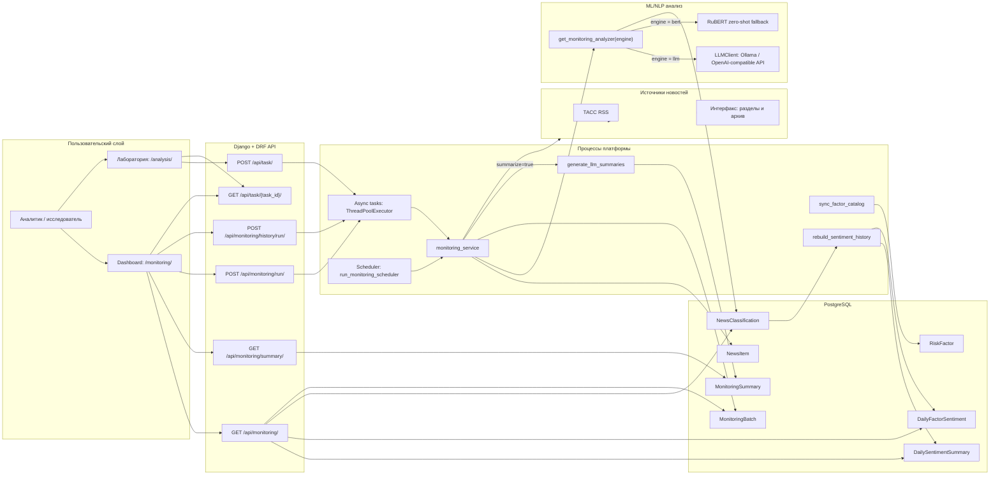
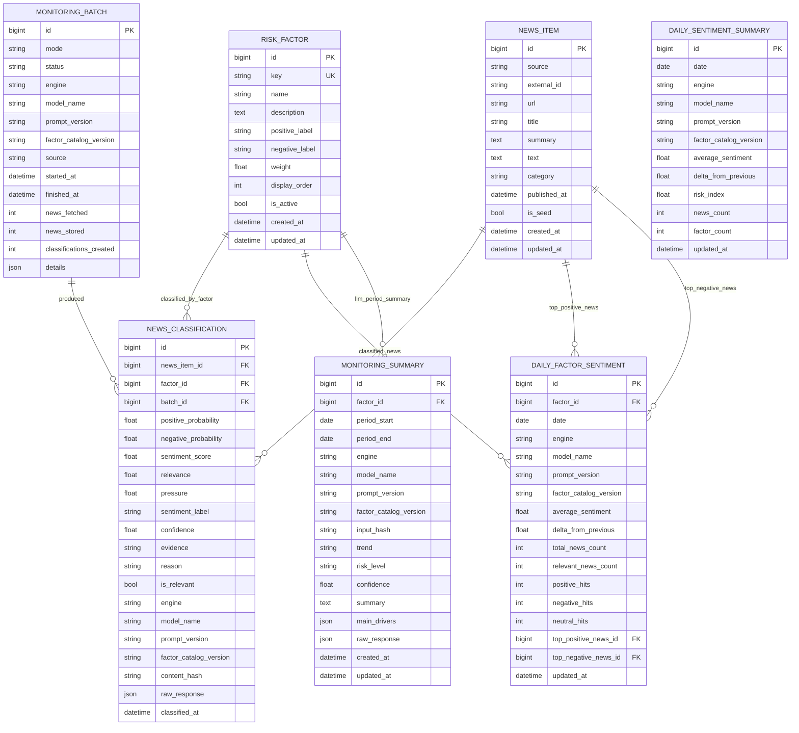
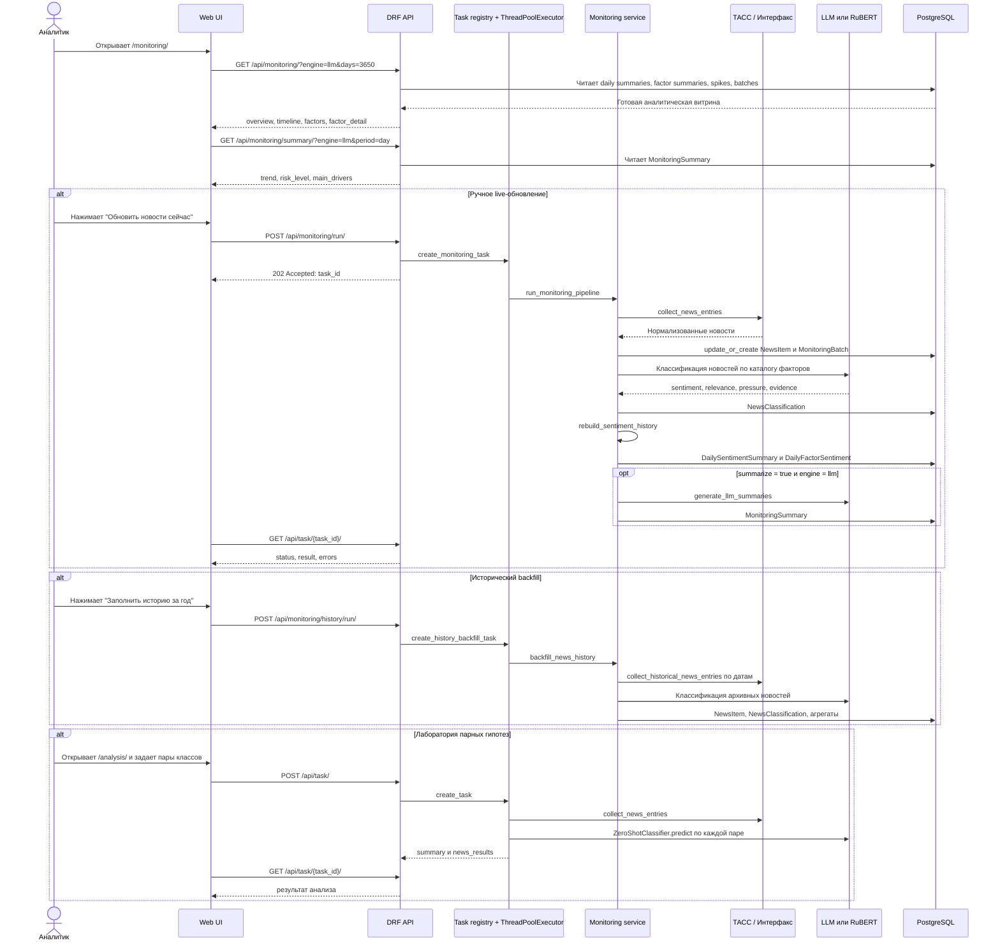

# Диаграммы системы мониторинга социальных рисков

Документ описывает исследовательскую платформу `Social Risk Monitor`: сбор новостей, классификацию сигналов по социальным факторам, хранение результатов и пользовательское взаимодействие через dashboard/API.

## Используемые технологии

| Слой | Технологии |
| --- | --- |
| Web/API | Django 4.2+, Django REST Framework, Django templates |
| Хранение | PostgreSQL 15, Django ORM, JSONField для деталей запусков и raw-ответов моделей |
| Сбор данных | Python `requests`, `BeautifulSoup`, RSS/XML parser, scraper-модуль для ТАСС и Интерфакса |
| ML/NLP | LLM через Ollama или OpenAI-compatible `/v1/chat/completions`; fallback: RuBERT zero-shot через PyTorch/Transformers |
| Оркестрация | Management commands, `ThreadPoolExecutor` для async-задач, scheduler-контейнер Docker Compose |
| Визуализация | HTML dashboard, JavaScript, Chart.js/canvas |
| Эксплуатация | Docker, Docker Compose, GitHub Actions, pytest/pytest-django |

## 1. Общая архитектура и поток данных

## 2. ERD базы данных

Ключевые ограничения:

- `NewsItem`: уникальность `(source, external_id)`.
- `NewsClassification`: уникальность `(news_item, factor, engine, model_name, prompt_version, factor_catalog_version)`.
- `DailySentimentSummary`: уникальность `(date, engine, model_name, prompt_version, factor_catalog_version)`.
- `DailyFactorSentiment`: уникальность `(factor, date, engine, model_name, prompt_version, factor_catalog_version)`.
- `MonitoringSummary`: уникальность `(factor, period_start, period_end, engine, model_name, prompt_version, factor_catalog_version)`.

## 3. Пользовательское взаимодействие, API и процессы

### Карта API

| Endpoint | Метод | Назначение |
| --- | --- | --- |
| `/monitoring/` | `GET` | Основная HTML-панель мониторинга. |
| `/analysis/` | `GET` | Лаборатория ручных пар классификации. |
| `/api/monitoring/` | `GET` | Данные dashboard: overview, timeline, факторы, всплески, детализация фактора. |
| `/api/monitoring/summary/` | `GET` | LLM-сводки по фактору/периоду: trend, risk level, drivers. |
| `/api/monitoring/run/` | `POST` | Запуск live-обновления новостей и классификации. |
| `/api/monitoring/history/run/` | `POST` | Исторический backfill по датам, источникам и лимитам. |
| `/api/task/` | `POST` | Запуск ad-hoc zero-shot анализа по заданным парам классов. |
| `/api/task/{task_id}/` | `GET` | Проверка статуса async-задачи и получение результата. |
